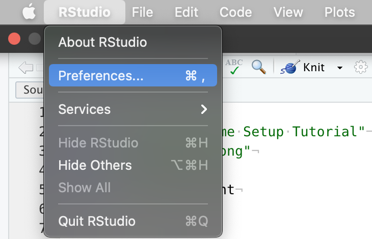
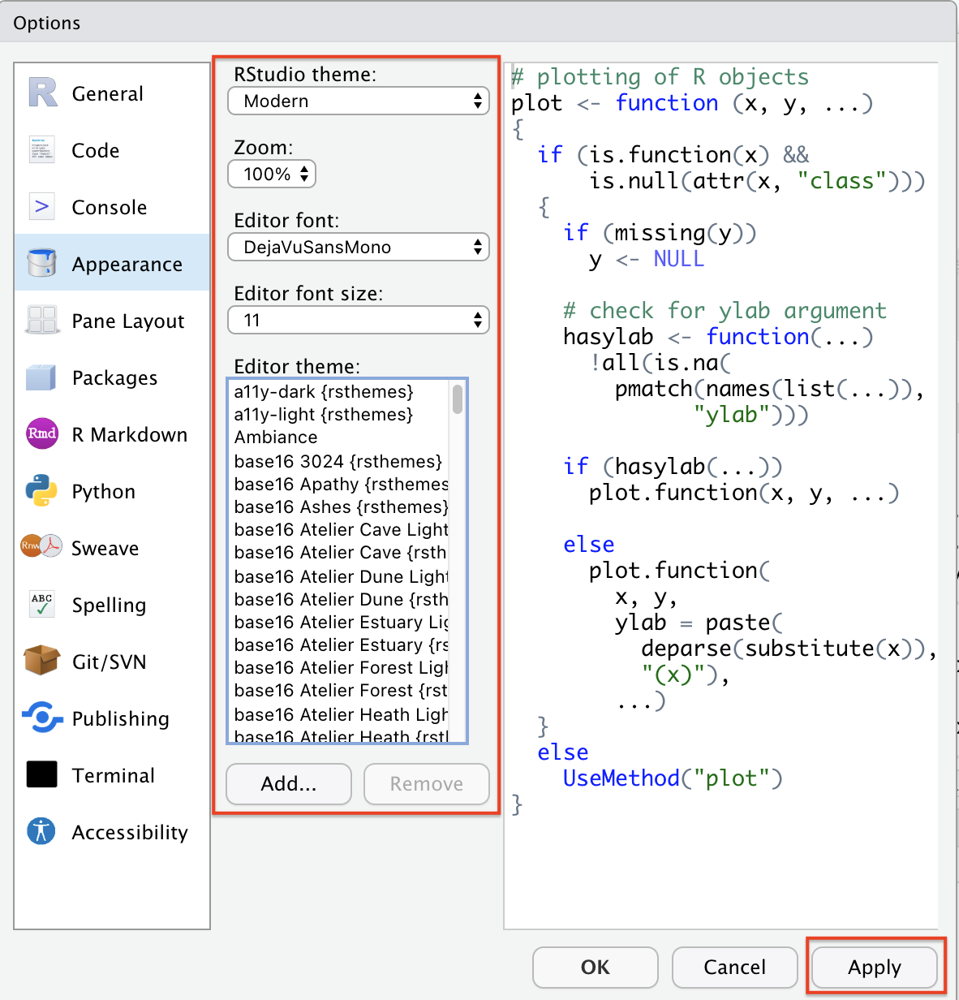
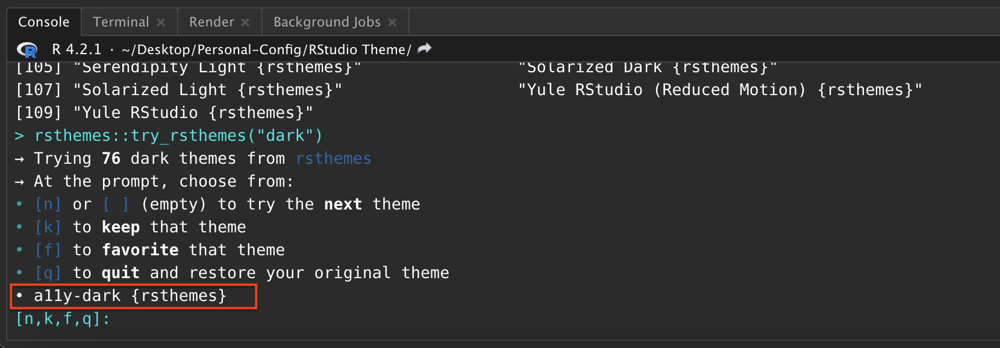
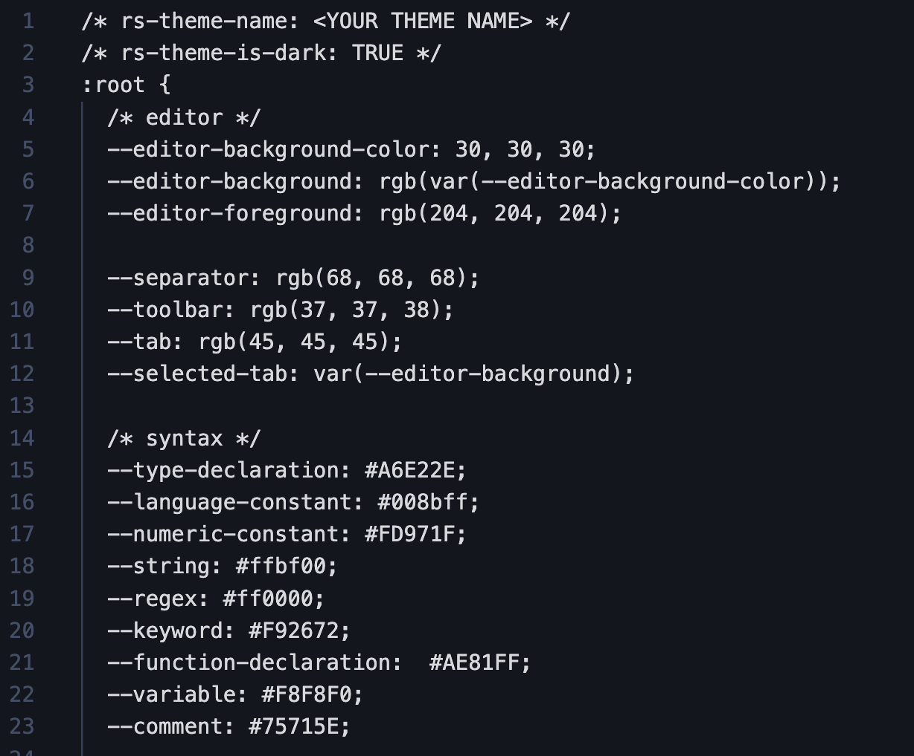
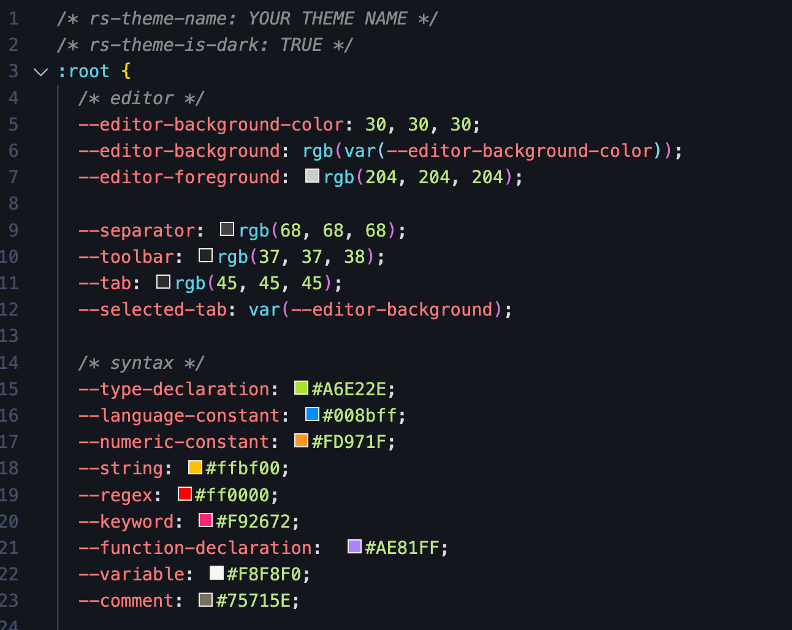
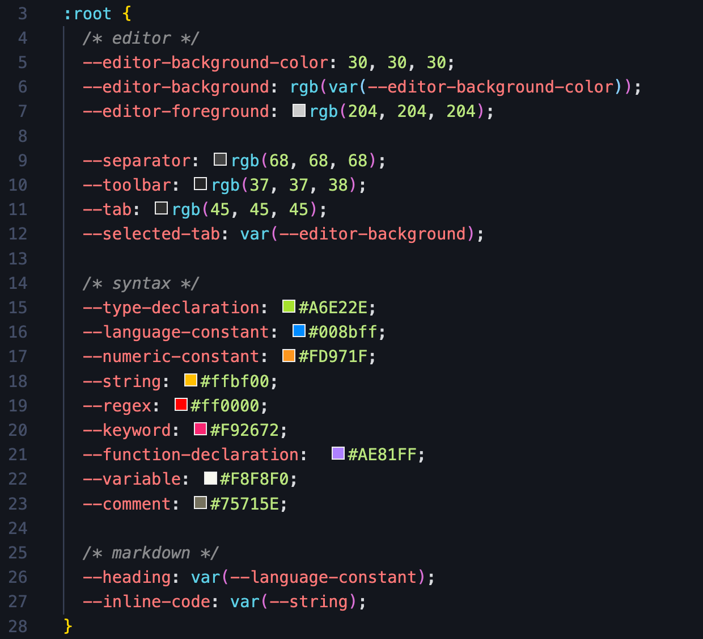

# RStudio-Theme-Customization

## Motivation

It is widely believed that most IDEs (Integrated Development
Environments), including Visual Studio Code, R Studio, and PyCharm,
boost programmers’ productivity by their versatile functionalities like
useful runtime configurations and visualizations. In addition, a good
IDE can help programmers accomplish many tasks correctly and
efficiently, like automatically syntax and style checking, version
control, and code refactoring. However, other than those
functionalities, as suggested by these two articles (
[\[1\]](https://www.diva-portal.org/smash/get/diva2:1337805/FULLTEXT01.pdf)
&
[\[2\]](https://blog.ndepend.com/6-reasons-visual-studio-theme-affects-productivity/)),
customized editor themes and layouts of IDEs are also important factors
which help improve the productivity of most of the programmers. In fact,
a well-designed and customized color theme not only enables programmers
to code and debug more efficiently, but also keep people concentrating
and refreshing through its attractive visual effects. In addition, as
mentioned in [this
article](https://www.corporatesuites.com/how-colors-affect-office-productivity/),
the effectiveness of coloring is very common in our life and this effect
has psychological support as well.

In this tutorial, I will focus on how to customize the editor theme in
RStudio by introducing two approaches: using existing themes from
[Github](https://github.com/mkearney/rstudiothemes) and creating our own
by editing
[`.rstheme`](https://rstudio.github.io/rstudio-extensions/rstudio-theme-creation.html)
file. The existing tutorial for RStudio color theme setup only focus on
the first approach so I will put more emphasis on the second approach.
Specifically, I will walk you through the detailed logic/syntax of
modifying a `.rstheme` (essentially a `.css`) file and provide some
examples/templates for you to use. In addition, I will also introduce
the pros and cons for each approach, along with some recommendations and
suggestions regarding theme design.

## Approach 1: Deploying Existing Color Themes

One of the most common way of configuring editor theme, also the most
straight-forward way, is to utilize existing themes created from RStudio
team and other people. The deployment of these themes are easy and are
often enough for some programmers who are not very interested in
creating their own themes.

### 1.1 RStudio Built-in Themes

To deploy built-in theme on your RStudio: (Example below is on Mac, but
it should be similar for Windows/Linux users)

1.  On the top left corner of your RStudio, click “RStudio” and then go
    to “Preferences”.

<!-- 
 -->

<!-- <figcaption style="align: center;"> -->
<!-- </figcaption> -->

Figure 1. The “Preferences” Page

<!-- <figcaption style="text-align: center;"></figcaption>
 -->

1.  Then go to “Appearances” and you can modify the overall theme of
    RStudio, change your editor theme to one of the RStudio built-in
    editor themes, and choose a font famliy and size for your editor.
    The panel on the right will show previews of your selected themes.

<!-- 
 -->

Figure 2. The “Appearance” Panel

<!-- 
<figcaption style="text-align: center;">
Figure 2. The “Appearance” Panel
</figcaption> -->

Note that there is a button called “Add”, implying that we can import
our own themes to RStudio. This is exactly what I will walk you through
in the second half of this tutorial. Be patient!

1.  After selection and adjustion, simply click on “Apply” at the bottom
    right corner and you are all set.

### 1.2 Using Themes From “rstheme” Library

As you probably noticed, the available themes are very limited in
RStudio so it is natural to use themes from existing R libraries.
“rstheme” is a well-known R library consisting of well-designed editor
themes developed by [Garrick Aden-Buie](https://github.com/gadenbuie).
There is a tutorial for this on Garrick’s webpage but I will
re-introduce and simplify the steps.

1.  Install the package from Github by typing the following command:

<!-- -->

    devtools::install_github("gadenbuie/rsthemes")

Please make sure you have “devtools” installed. If you have not,
installed it using the following commands:

    install.packages("devtools")

1.  Install all themes to your local RStudio. Note that
    [Base16](https://github.com/chriskempson/base16) is a framework for
    building themes using a base of 16 colors. Because it is a useful
    framework as it is introduced, you can also leverage on that to
    create your own themes; but this is not the focus of this tutorial.
    If you are interested in that, please check
    [here](https://github.com/chriskempson/base16/blob/main/builder.md)
    for more details. The “include_base16” argument simply controls
    whether we want to download Base16-based themes.

<!-- -->

    rsthemes::install_rsthemes(include_base16 = TRUE)

1.  After installation, we can browse and try all available themes by
    typing:

<!-- -->

    rsthemes::list_rsthemes() # List the names of all themes
    rsthemes::try_rsthemes("dark") # try dark themes; can also be "light" or "base16"

Then, an interactive session will start and you can try all editor
themes on your own. Suppose you also want to explore “dark” themes, your
RStudio console should look like this: (Note that your RStudio themes
change automatically as you entered an interactive session)

Figure 3. Interactive Theme Changing Session

<!-- <figcaption style="text-align: center;">
Figure 3. Interactive Theme Changing Session
</figcaption> -->
<!-- <figcaption style="text-align: center;"></figcaption>
-->

You can easily find the name of current theme at the bottom and add that
to your favorite theme list following the prompts in the console.

1.  Whenever you found a theme that fits your style, you can just press
    “ESC” to quit the interactive session and the theme will be
    configured automatically. In case this does not work (for some users
    this may not work because of their RStudio security and privacy
    configurations), please simply try the following two methods:

- Similar to what we did in 1.1, as we have already downloaded the
  themes, we can always go to “RStudio -&gt; Preference -&gt;
  Appearance” to change the themes.
- On the other hand, we can deploy the theme simply by typing the
  following command in console and specifying the name of the theme we
  installed.

<!-- -->

    rstudioapi::applyTheme("<theme_name>")

1.  As I mentioned before, “rstheme” is a comprehensive package about
    RStudio editor themes and there are more advanced options including
    modifying your favorite themes lists or switching between themes. If
    you are interested in that, please check detailed documentations via
    [this blog
    post](https://www.garrickadenbuie.com/project/rsthemes/#usage) and
    [the Github source](https://github.com/gadenbuie/rsthemes).

## Approach 2: Building Own Editor Themes From Scratch

Even though existing themes from Github packages are good, the editor
themes are sometimes too complex for everyone to fully accept. For
example, people may only like a portion of the editor styles but when
using that, they have bear the things that they don’t really enjoy. How
can we solve this problem? Just building your own theme from scratch.

### 2.1 What is `.rstheme` file?

In order to configure customized editor themes, we need to write a
`.rstheme` file or modify the template of it. In short, a `.rstheme`
file is essentially a CSS ([Cascading Style
Sheets](https://www.w3.org/Style/CSS/Overview.en.html)) and when editing
it, we just follow the grammars and styles in CSS. CSS is a very common
mechanism and often refered as a stylesheet language used for adding
style configurations to Web page. For this tutorial, you do not have to
be an expert about that! But please feel free to check [this
blog](https://www.theserverside.com/definition/cascading-style-sheet-CSS)
to get a sense of how CSS works.

### 2.2 Download `.rstheme` file template & Setup

1.  Download the .rstheme template file from
    [here](https://github.com/Xiaoyang-Song/RStudio-Theme-Customization).
    After downloading it, open it using Visual Sudio Code (VS Code) or
    RStudio. The first one is recommended because it has a bunch of
    addins that we can utilize to make our life easier.

2.  Change the filename from `template.rstheme` to `template.css`. Note
    that we use `.css` extension here because VS Code will render it in
    a more elegant way than the raw `.rstheme` file. You can see that
    the file with `.css` extension fully exploit the advantages of
    colors and has good visual effects.

&nbsp;
&nbsp;

Figure. 4: .rstheme extension (left) and .css extension(right)

However, this step is completely optional. If you are comfortable with
directly editing the raw `.rstheme` file, you are welcome to do so as
well; but in that case, you may not be able to exploit the advantages of
color.

1.  Then, at the first line of the file, replace the place holder
    strings with your theme name.

### 2.3 Declaration of Global Variables

As in other programming languages, we can declare a set of global
variables at the beginning and use them later. In the template file,
locate the CSS pseudoclass `root`; if you do not modify the source file,
the code chunk should start at line 3 and its content should be like the
figure below. (The understanding of pseudoclass is not important here
but please check [this
documentation](https://developer.mozilla.org/en-US/docs/Web/CSS/:root)
if you are interested in)

Figure 5. Global Variable Declaration

Inside the root class, there are many useful global variables that we
can define. To define your own color, you can follow any of the four
options below (when copying the following code, remember the semicolon).
For RGB or hex color representation converter, please check [this
website](https://imagecolorpicker.com/color-code/2596be).

    --<your-color-name>: #A6E22E; /* hex color representation */
    --<your-color-name>: rgb(x,y,z); /* normal RGB color */
    --<your-color-name>: rgba(x,y,z,a); /* add opacity */
    --<your-color-name>: var(<name-of-existing-color>) /* using existing color */

This template file has already declared many useful gloabl variables for
you with informative names. I suggest taking advantages of them first
and adding your own when necessary. For example,
`--numeric-constant: #008bff;` specifies that every numeric constant
should be blue. We will be using these useful global variables for most
of the configurations.

### 2.4 Basic Logic & Syntax

After configuring global variables, we can start use them to setup
colors for different parts of RStudio and different chunks of codes. For
example, we may want the keywords (e.g. `if`, `else`, `for`) to have
different colors than strings. This can significantly help with
debugging. The syntax of setting up color for a specific part is the
following. (Note that in the language of CSS, such configuration can
include many properties other than color, and the whole structure below
is often called the
[“ruleset”](https://developer.mozilla.org/en-US/docs/Learn/Getting_started_with_the_web/CSS_basics))

    .<Identifier> {
      color: <YOUR_COLOR>;
      /* There are tons of properties that can be modified here, e.g. */
      background-color: <YOUR_BG_COLOR>;
      width: <YOUR_WIDTH>;
      font-weight: <YOUR_FONT_WEIGHT>;
      /* ... */
    }

#### 2.4.1 Identifier (i.e. CSS Selector)

RStudio has different identifiers (also called selector in the language
of CSS) for different code chunks and parts in the IDE. To configure the
color for them, we need to first identify their “Identifier” by checking
[this
table](https://rstudio.github.io/rstudio-extensions/rstudio-theme-creation.html)
from RStudio Official Documentation. Note that if you want multiple
parts to have the same configuration, you can put multiple identifiers
together, separated by comma.

    .<Identifier_1>, .<Identifier_2>, ...{
      /* YOUR CONFIGURATION GOES HERE */
    }

#### 2.4.2 CSS Property

There are many properties other than color that can also be modified in
the ruleset. Please refer to this document for all possible [CSS
properties](https://jenkov.com/tutorials/css/css-properties-css-rules.html#:~:text=A%20CSS%20rule%20is%20a,target%20with%20the%20CSS%20rule.)
that you can configure. The general syntax is provided below:

    .<Identifier> {
      <Property_1>: <Property_1_Value>;
      <Property_2>: <Property_2_Value>;
      /* ... */
    }

In this tutorial, we will mainly focus on the property `color`, but
other properties like `background-color` and `margin` can be important
when we want to adjust the overall editor styles, while property like
`font-weight` and `font-family` can be useful if we want to display
error message with emphasis.

### 2.5 Some Useful Examples

Now, with the knowledge of how it works, I will walk you through some
example configurations and provide some suggestions of setting up
themes.

#### 2.5.1 Example 1: Change Cursor Color

You can setup the color of your cursor simply using the following
ruleset; the width can also be adjusted according to your preferences.
Note that the specification of `<YOUR_COLOR>` can use any of the four
methods mentioned in section 2.3.

    .ace_cursor {
      border-color: <YOUR_COLOR>;
      width: 2px;
    }

#### 2.5.2 Example 2: Highlight Selection

When selecting portion of code in RStudio, you often want it to be
highlighted. This can be achieved by modifying ruleset `.ace_selection`
like the following. Simply changing the `background_color` property to
be whatever color you want it to be.

    .ace_selection {
      background-color: <YOUR_BG_COLOR>;
    }

#### 2.5.3 Conclusion

The two aformentioned examples are just illustrations of how we can
modify the ruleset. The configuration for other parts should not be
significantly different from these two examples. The template that I
provided to you contain nearly everything with default color values.
What you need to do is just figure out what each part is referring to by
reading RStudio documentation and modify the color property.

### 2.6 Dealing With Hierarchy

As you probably noticed in the template or in the table from RStudio
documentation, there exists hierarchies in the identifiers (selectors).
For example, `.ace_numeric` and `.ace_language` are the children of
`.ace_constant`, so modifying the ruleset for `.ace_constant` will
automatically override the ruleset for `.ace_language`. Similar things
happens for `.ace_operator` and `.ace_keyword` where the latter is of
higher level than the first selector.

#### 2.6.1 Explicitly Define Rulesets

One way to deal with the hierarchical structure in CSS selectors is to
explicitly define ruleset for each selector in the hierarchy. For
example, taking the aforementioned `.ace_constant` for example, in order
to avoid conflicts, we can simply do the following so that
`language constants` and `numeric constants` have different colors.
However, when doing this, be sure not to specify `.ace_constant` as it
will override all of them implicitly.

    /* Example */
    .ace_constant.ace_language{
      color: var(--language-constant);
    }
    .ace_constant.ace_numeric{
      color: var(--numeric-constant);
    }
    /* Define ruleset for other selectors under .ace_constant below */
    /* ... */

However, if we want everything under `.ace_constant` to have the same
style (i.e. ruleset), we can just do it in one-shot:

    .ace_constant {
      /*YOUR CONFIGURATION GOES HERE*/
    }

#### 2.6.2 Using the `not` Keyword

We can leverage on the previous methods to solve any potential problems
about CSS selector hierarchies. However, if you want to declare ruleset
for every selector in a hierarchy, it requires the exposure and
knowledge to all possible children selectors, which is time-consuming
and not effective. In most of the case, we only want to modify part of
the selectors under a hierarchy. For instance, for `.ace_keyword`, we
sometimes want all keywords to have the same styles but the operator
(`.ace_operator`) to have its own style.

In this example, if we use method in 2.6.1, we need knowledge of every
single selector under `.ace_keyword` and specify styles for all of them
manually. This is terrible. One another method we can use is take
advantage of the `not` keyword. The following code illustrates how it
works.

    .ace_keyword:not(.ace_operator){
      /* YOUR CONFIGURATION FOR ALL .ace_keyword OTHER THAN .ace_keyword.ace_operator */
    }
    .ace_operator{
      /* YOUR CONFIGURATION GOES HERE */
    }

You first configure styles for `.ace_keyword` without `.ace_operator`
and then you create a new ruleset for `.ace_operator`. This method is
recommended in practice because it is more elegant and efficient.

#### 2.6.3 Miscellaneous

Note that in this section, I referred the problem that changing styles
of certain selector will override the styles of other selector as
hierarchical conflicts and made analogies including parents and
children. However, the terminology here is not accurate enough. A more
accurate description is the following: the “scope” of some selector may
be contained in the “scope” of other selectors so overriding issue will
happen. To make it concrete, the scope for `.ace_constant` is all
constants including boolean, numeric, and language constants. However,
the scope for `.ace_numeric` is just numeric constant, which is
contained by the scope of `.ace_constant`. Therefore, conflicts
(overriding) will happen if we do not handle them correctly. However, I
hope the illustration using parents and children make sense to you.

### 2.7 Use the Template

Now you should be able to write a `.rstheme` (essentially `.css`) file
yourself from scratch to configure styles for your RStudio IDE. However,
that is a great pain so I provided you a template which contains nearly
all possible selectors that you may want to modify. In the template, you
can find the place to configure styles for the following main components
in your IDE:

1.  Code editor (i.e. code colors & styles)
2.  R console input/output styles
3.  Terminal intput/output styles
4.  Toolbars, tabs, and splitters
5.  R markdown styles

There are plenty of components other than those five common ones which
you can play with. However, changing styles of them require more
sophisticated understanding of CSS and may not be very useful for
overall theme setting. Furthermore, I would like to quote one valuable
advice from the RStudio official documentation: “In addition to these
rule sets, you will also find a number of rule sets related to the
Terminal pane, with selectors that include .terminal or selectors that
begin with .xterm. It is possible to change these values as well, but it
may be advisable to keep a back up copy of your original theme in case
you don’t like any of the changes.”

### 2.8 Deploy Your Themes to RStudio

After we finished editing the `.css` file and configured all styles that
you liked, we can simply convert the file back to `.rstheme` by simply
changing the file extension to `.rstheme`. Now your customized theme is
available and we need to add it to RStudio.

1.  Go to “RStudio” -&gt; “Preference” -&gt; “Appearance”.
2.  Click “Add” and add your `.rstheme` file into RStudio.
3.  After you are done, simply select it and click “Apply”, and you
    deployed your personal theme.

After your deployment, if you find anything that you want to further
modify, you can do the modification directly on your `.rstheme` file and
then “Add” it to your RStudio again following those steps. However, be
sure to delete your previous theme before adding new ones, or you can
name your new theme with a different name (just change the first line of
your source file). To remove a theme from RStudio:

1.  Again, go to “RStudio” -&gt; “Preference” -&gt; “Appearance”.
2.  Select the theme you want to remove; if you want to remove the theme
    you are currently using, please switch to another theme first.
3.  Click “Remove” and you are all set.

### 2.9 Things to be Avoided & Design Tips

Now, you are equipped with toolboxes to design your personalized theme.
Designing a light mode theme is straightforward but as shown by many
research and survey, the development of dark mode theme can be tricky
and there are lots of things to be avoided. I would like to share some
articles which introduced some common tips when designing dark mode
themes.

1.  [8 Tips for Dark Theme
    Design](https://uxplanet.org/8-tips-for-dark-theme-design-8dfc2f8f7ab6)
2.  [DARK UI DESIGN – 11 TIPS FOR DARK MODE
    DESIGN](https://www.halo-lab.com/blog/dark-ui-design-11-tips-for-dark-mode-design)
3.  [Designing for dark mode: 7 tips to help you do it
    well](https://tillerdigital.com/blog/designing-for-dark-mode-7-tips-to-help-you-do-it-well/)
4.  [6 dark mode design tips for
    developers](https://blog.codemagic.io/6-dark-mode-design-tips/)
5.  [Stepping Out of the Light: Tips for the design and development of
    dark
    mode](https://medium.muz.li/stepping-out-of-the-light-tips-for-the-design-and-development-of-dark-mode-bb6f7a38043d)

## Other Approaches

There are definitely more than two approaches to configure styles for
IDEs like RStudio. I would like to briefly introduce one more common
method: creating a `.tmTheme` file first and then modifying the
`.rstheme` file that RStudio generated based on it. In general,
`.tmTheme` file is a [XML](https://en.wikipedia.org/wiki/XML)-based
theme configuration file. Here is a very useful [`.tmTheme` Development
Web App](https://tmtheme-editor.herokuapp.com/#!/editor/theme/Monokai)
that can be used to develop your own `.tmTheme`.

However, I would NOT recommend using this approach as `.tmTheme` is a
general theme setting approach while `.rstheme` that we mainly covered
in this tutorial is the one designed for RStudio only. The automatic
conversion mentioned in the preceding paragraph may have many warnings
and unexpected errors. Therefore, using `.tmTheme` may result in many
unexpected behavior if you do not handle the gap and its compatibility
with RStudio carefully. Furthermore, if you want to do more advanced
configuration like what we did for `.rstheme` file, those online editor
may not be enough and you also have to dive into the source code and
modify it, and it is harder to debug too.

## References

1.  <https://www.diva-portal.org/smash/get/diva2:1337805/FULLTEXT01.pdf>
2.  <https://blog.ndepend.com/6-reasons-visual-studio-theme-affects-productivity/>
3.  <https://www.corporatesuites.com/how-colors-affect-office-productivity/>
4.  <https://github.com/mkearney/rstudiothemes>
5.  <https://github.com/gadenbuie>
6.  <https://www.garrickadenbuie.com/project/rsthemes/#usage>
7.  <https://github.com/chriskempson/base16>
8.  <https://github.com/chriskempson/base16/blob/main/builder.md>
9.  <https://www.w3.org/Style/CSS/Overview.en.html>
10. <https://www.theserverside.com/definition/cascading-style-sheet-CSS>
11. <https://developer.mozilla.org/en-US/docs/Web/CSS/:root>
12. <https://developer.mozilla.org/en-US/docs/Learn/Getting_started_with_the_web/CSS_basics>
13. <https://imagecolorpicker.com/color-code/2596be>
14. <https://rstudio.github.io/rstudio-extensions/rstudio-theme-creation.html>
15. <https://jenkov.com/tutorials/css/css-properties-css-rules.html#>
16. <https://uxplanet.org/8-tips-for-dark-theme-design-8dfc2f8f7ab6>
17. <https://blog.prototypr.io/8-tips-for-perfect-dark-theme-ui-5aa34784784e>
18. <https://www.halo-lab.com/blog/dark-ui-design-11-tips-for-dark-mode-design>
19. <https://tillerdigital.com/blog/designing-for-dark-mode-7-tips-to-help-you-do-it-well/>
20. <https://blog.codemagic.io/6-dark-mode-design-tips/>
21. <https://en.wikipedia.org/wiki/XML>
22. <https://tmtheme-editor.herokuapp.com/#!/editor/theme/Monokai>
